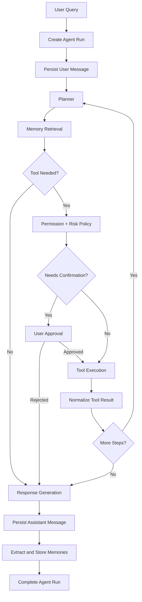
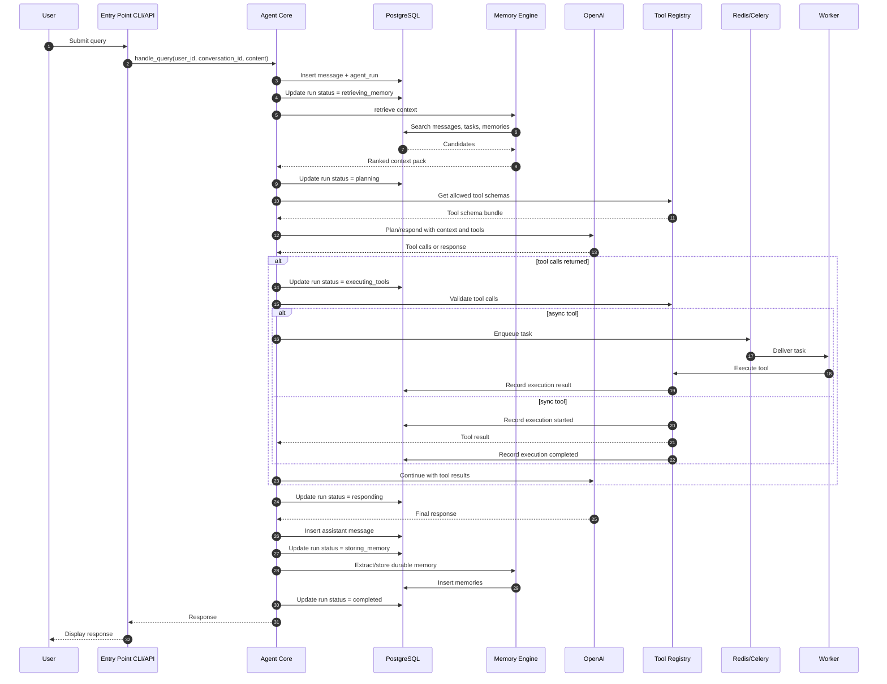
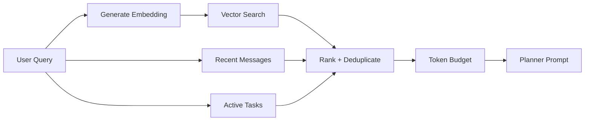
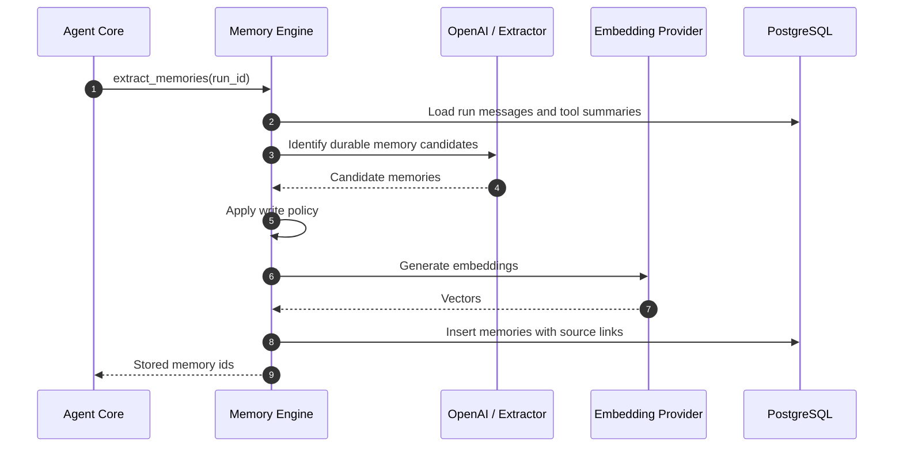
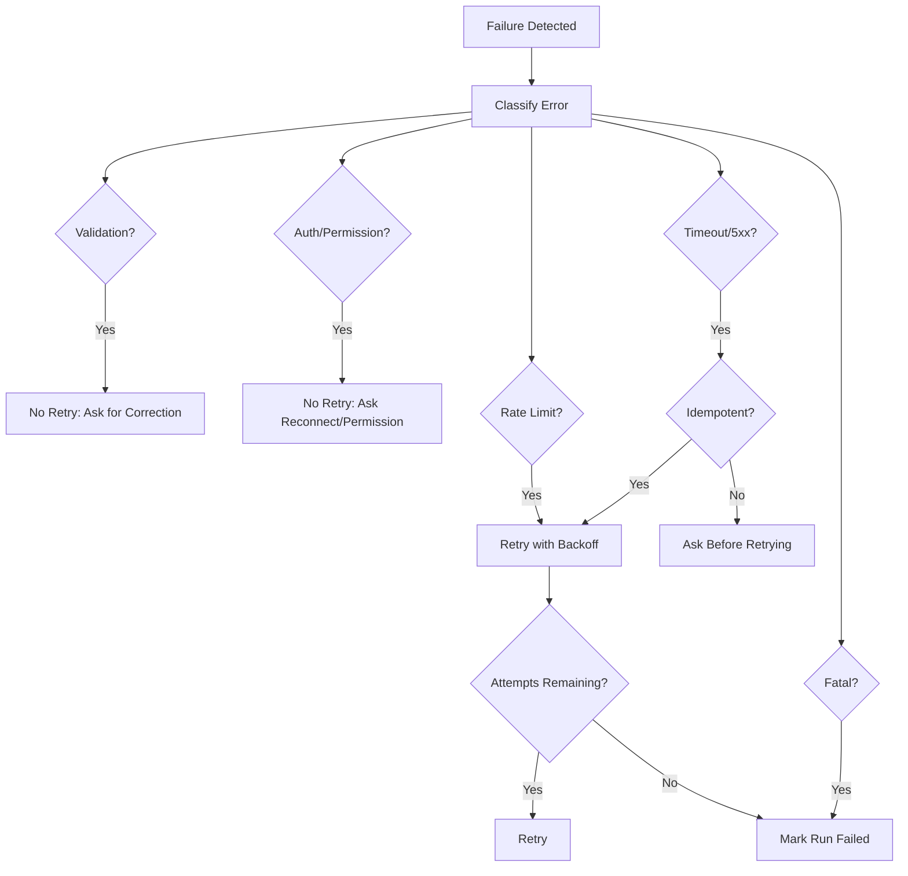

# Agent Flow

## Purpose

This document defines the complete lifecycle of an agent request: user input, planning, memory retrieval, tool decision, tool execution, response generation, and memory storage. It also defines failure handling and retry behavior so implementation remains deterministic and operable.

## Lifecycle Overview

## Agent Run States

| State | Meaning | Terminal |
| --- | --- | --- |
| `created` | Run row exists, user message persisted. | No |
| `planning` | Model is producing plan/tool calls. | No |
| `retrieving_memory` | Memory context is being loaded. | No |
| `awaiting_confirmation` | User approval required before side effect. | No |
| `executing_tools` | One or more tools are running. | No |
| `responding` | Final answer is being generated. | No |
| `storing_memory` | Durable memories are being extracted/stored. | No |
| `completed` | User response is persisted and returned. | Yes |
| `failed` | Run failed after retry policy. | Yes |
| `cancelled` | User or system cancelled execution. | Yes |

## Detailed Sequence

## Planning

The planner receives:

- User message.
- Conversation summary and recent turns.
- Ranked memory context pack.
- Active tasks.
- Tool schema bundle.
- System policy and confirmation rules.

The planner returns one of:

| Output | Meaning |
| --- | --- |
| Final response | No tool required. |
| Tool call list | One or more tool invocations required. |
| Clarifying question | Required input is missing or action risk is too high. |
| Refusal/safety response | Request violates policy or permission boundary. |

## Memory Retrieval

Memory retrieval happens before planning and may happen again after tool execution if tool outputs introduce new context needs. Retrieval is always scoped by `user_id`.

## Tool Decision

Tool decision should be conservative:

| Question | If Yes |
| --- | --- |
| Can the request be answered from context alone? | Do not call external tools. |
| Is current external data required? | Use read-only tool first. |
| Will the tool create, update, delete, send, or publish? | Require policy check and likely confirmation. |
| Is the call slow or retryable? | Submit Celery task. |
| Is user authorization missing? | Ask user to connect integration. |

## Response Generation

The final response is generated from:

- User message.
- Relevant conversation history.
- Ranked memories.
- Completed tool outputs.
- Any skipped/failed tool context.
- Confirmation outcomes.

Responses should be direct about uncertainty. If a tool failed, the agent should state what was completed, what failed, and whether a retry is pending.

## Memory Storage

After response generation, the memory engine evaluates whether the interaction created durable knowledge.

Memory storage can be async when response latency matters. The run should record whether memory extraction was completed inline or queued.

## Failure Handling

## Retry Strategy

| Operation | Retry Policy | Notes |
| --- | --- | --- |
| OpenAI planning | 2-3 retries on transient errors | Preserve same prompt and run id. |
| Embedding generation | 3 retries with exponential backoff | Can be async. |
| Read-only provider calls | 3 retries on 429/5xx/timeouts | Respect `Retry-After`. |
| Write provider calls | Retry only with idempotency key | Avoid duplicate side effects. |
| Browser automation | 1 retry max | Capture screenshot/logs on failure. |
| Database writes | Retry serialization/deadlock errors | Do not retry unknown commit outcome without idempotency. |
| Redis enqueue | Short retry, then fail fast | PostgreSQL remains source of truth. |

## Idempotency Rules

| Action | Idempotency Requirement |
| --- | --- |
| Create agent run | Request id or generated run id. |
| Enqueue Celery task | `agent_run_id + task_type + stable_hash(payload)`. |
| Send email | Exact draft/message id and user confirmation id. |
| Create calendar event | Stable external request id if provider supports it, otherwise local dedupe. |
| Store memory | Source message/run id plus normalized content hash. |

## Cancellation

Cancellation must:

- Mark the `agent_run` as `cancelled`.
- Revoke or ignore pending Celery tasks when possible.
- Avoid starting new side-effecting tools.
- Leave completed tool execution audit rows intact.
- Return a user-visible summary of what already happened.

## Observability

| Signal | Required Dimensions |
| --- | --- |
| Run latency | `entrypoint`, `model`, `tool_count`, `status`. |
| Tool latency | `tool_name`, `provider`, `status`. |
| Memory retrieval latency | `candidate_count`, `selected_count`, `embedding_model`. |
| Error rate | `component`, `error_code`, `retry_count`. |
| Token usage | `model`, `planner_version`, `conversation_id`. |

Every log line for an agent request should include `agent_run_id` and `user_id` where safe.

## Future Scalability Notes

- Split planning and execution into separate orchestrator stages when multi-step workflows become long-running.
- Add streaming response support so the user sees progress during slow tool calls.
- Add resumable workflows backed by persisted plans.
- Add a policy engine for per-tool, per-user, and per-risk approvals.
- Add distributed tracing across API, worker, tool adapters, and database calls.

