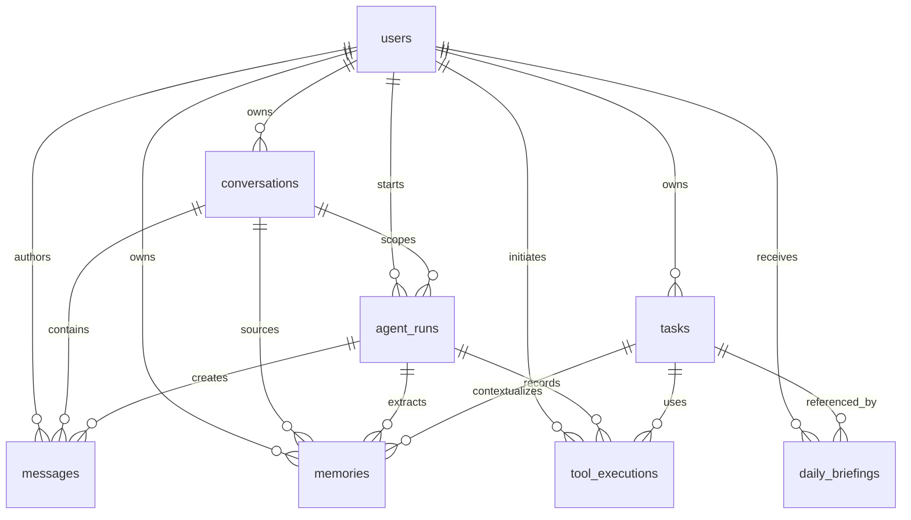

# Database Design

## Overview

PostgreSQL is the system of record for Personal-AI-Agent. It stores users, conversations, messages, memories, tasks, daily briefings, tool executions, and agent runs. pgvector extends PostgreSQL with semantic memory search while preserving transactional integrity and simple operations.

All database access should go through repository modules. Agent code should depend on domain methods such as `create_agent_run`, `search_memories`, or `record_tool_execution`, not raw SQL spread across the runtime.

## Entity Relationship Diagram



## Extensions

```sql
CREATE EXTENSION IF NOT EXISTS vector;
CREATE EXTENSION IF NOT EXISTS pgcrypto;
```

Use UUID primary keys generated by the application or `gen_random_uuid()`.

## Common Columns

Most tables should include:

| Column | Purpose |
| --- | --- |
| `id` | UUID primary key. |
| `created_at` | Insert timestamp. |
| `updated_at` | Last mutation timestamp. |
| `deleted_at` | Nullable soft-delete marker when applicable. |

Use `timestamptz` for all timestamps.

## Table: `users`

### Purpose

Stores user identity, profile defaults, timezone, and integration configuration references.

### Important Columns

| Column | Type | Notes |
| --- | --- | --- |
| `id` | UUID PK | Stable user id. |
| `email` | `citext` or `text` | Unique login/email identity. |
| `display_name` | `text` | Optional UI/response personalization. |
| `timezone` | `text` | IANA timezone, for example `Asia/Kolkata`. |
| `locale` | `text` | Optional response/calendar formatting. |
| `settings` | `jsonb` | User preferences and feature flags. |
| `created_at` | `timestamptz` | Creation time. |
| `updated_at` | `timestamptz` | Last update. |

### Indexes

| Index | Columns | Purpose |
| --- | --- | --- |
| `users_email_unique` | `email` unique | Login lookup. |
| `users_created_at_idx` | `created_at` | Admin/reporting. |

### Relationships

`users` is the parent for all user-owned data. Every user-scoped query must filter by `user_id`.

### Future Scaling Notes

If multi-account or team features are added, introduce `accounts`, `memberships`, and role-based access instead of overloading `users`.

## Table: `conversations`

### Purpose

Groups messages and agent runs into a coherent user-visible thread.

### Important Columns

| Column | Type | Notes |
| --- | --- | --- |
| `id` | UUID PK | Conversation id. |
| `user_id` | UUID FK | Owner. |
| `title` | `text` | Generated or user-provided title. |
| `status` | `text` | `active`, `archived`, `deleted`. |
| `summary` | `text` | Rolling conversation summary. |
| `metadata` | `jsonb` | Client or source metadata. |
| `last_message_at` | `timestamptz` | Sorting and resume. |
| `created_at` | `timestamptz` | Creation time. |
| `updated_at` | `timestamptz` | Last update. |

### Indexes

| Index | Columns | Purpose |
| --- | --- | --- |
| `conversations_user_last_message_idx` | `(user_id, last_message_at DESC)` | Conversation list. |
| `conversations_user_status_idx` | `(user_id, status)` | Active/archive filtering. |

### Relationships

One conversation has many messages, agent runs, and source memories.

### Future Scaling Notes

Partition only if message volume becomes extreme. Conversation rows are small; `messages` will grow faster.

## Table: `messages`

### Purpose

Stores the canonical conversation transcript and model-visible content.

### Important Columns

| Column | Type | Notes |
| --- | --- | --- |
| `id` | UUID PK | Message id. |
| `user_id` | UUID FK | Owner. |
| `conversation_id` | UUID FK | Thread. |
| `agent_run_id` | UUID FK nullable | Run that created the message. |
| `role` | `text` | `user`, `assistant`, `system`, `tool`. |
| `content` | `text` | Message text or serialized tool summary. |
| `content_type` | `text` | `text`, `json`, `markdown`. |
| `metadata` | `jsonb` | Token counts, source, attachments, citations. |
| `created_at` | `timestamptz` | Message time. |

### Indexes

| Index | Columns | Purpose |
| --- | --- | --- |
| `messages_conversation_created_idx` | `(conversation_id, created_at)` | Transcript loading. |
| `messages_user_created_idx` | `(user_id, created_at DESC)` | Recent activity. |
| `messages_agent_run_idx` | `agent_run_id` | Run replay. |

### Relationships

Messages belong to users and conversations. Assistant/tool messages can link to an `agent_run`.

### Future Scaling Notes

Messages are append-heavy. If volume grows, consider monthly partitioning by `created_at` and compress old transcripts into summaries.

## Table: `memories`

### Purpose

Stores durable knowledge, preferences, task context, summaries, and embedded semantic memory.

### Important Columns

| Column | Type | Notes |
| --- | --- | --- |
| `id` | UUID PK | Memory id. |
| `user_id` | UUID FK | Owner and retrieval boundary. |
| `conversation_id` | UUID FK nullable | Source conversation. |
| `agent_run_id` | UUID FK nullable | Extraction run. |
| `task_id` | UUID FK nullable | Related task. |
| `type` | `text` | `preference`, `fact`, `summary`, `task`, `tool_result`, `document`, `episodic`. |
| `content` | `text` | Memory body. |
| `embedding` | `vector(n)` | Semantic representation. |
| `embedding_model` | `text` | Model used for vector. |
| `importance` | `numeric(4,3)` | 0.0 to 1.0. |
| `confidence` | `numeric(4,3)` | 0.0 to 1.0. |
| `source` | `text` | `user`, `assistant`, `tool`, `integration`, `summary`. |
| `metadata` | `jsonb` | Provider ids, tags, supersedes ids. |
| `access_count` | `integer` | Retrieval frequency. |
| `last_accessed_at` | `timestamptz` | Ranking signal. |
| `expires_at` | `timestamptz` nullable | Time-sensitive memory expiry. |
| `deleted_at` | `timestamptz` nullable | Soft delete. |
| `created_at` | `timestamptz` | Creation time. |
| `updated_at` | `timestamptz` | Last update. |

### Indexes

| Index | Columns | Purpose |
| --- | --- | --- |
| `memories_user_type_idx` | `(user_id, type)` | Filtered lookup. |
| `memories_user_created_idx` | `(user_id, created_at DESC)` | Recent memories. |
| `memories_task_idx` | `task_id` | Task context. |
| `memories_metadata_gin_idx` | `metadata` GIN | Tags/provider lookup. |
| `memories_embedding_hnsw_idx` | `embedding vector_cosine_ops` | Semantic search. |

### Relationships

Memories may source from conversations, agent runs, tasks, and tool executions through metadata or explicit links.

### Future Scaling Notes

Use pgvector HNSW for low-latency approximate search. If table size grows beyond operational comfort, partition by user hash or migrate vector search to a dedicated service while keeping canonical memory rows in PostgreSQL.

## Table: `tasks`

### Purpose

Tracks user commitments, reminders, projects, and agent-managed units of work.

### Important Columns

| Column | Type | Notes |
| --- | --- | --- |
| `id` | UUID PK | Task id. |
| `user_id` | UUID FK | Owner. |
| `conversation_id` | UUID FK nullable | Origin thread. |
| `title` | `text` | Short task label. |
| `description` | `text` | Longer detail. |
| `status` | `text` | `pending`, `in_progress`, `blocked`, `completed`, `cancelled`. |
| `priority` | `text` | `low`, `normal`, `high`, `urgent`. |
| `due_at` | `timestamptz` nullable | Deadline/reminder time. |
| `completed_at` | `timestamptz` nullable | Completion time. |
| `metadata` | `jsonb` | Dependencies, labels, external ids. |
| `created_at` | `timestamptz` | Creation time. |
| `updated_at` | `timestamptz` | Last update. |

### Indexes

| Index | Columns | Purpose |
| --- | --- | --- |
| `tasks_user_status_due_idx` | `(user_id, status, due_at)` | Active task list and briefings. |
| `tasks_user_priority_idx` | `(user_id, priority)` | Prioritization. |
| `tasks_metadata_gin_idx` | `metadata` GIN | External id lookup. |

### Relationships

Tasks can link to memories, tool executions, daily briefings, and source conversations.

### Future Scaling Notes

Introduce task dependencies as a separate `task_dependencies` table once workflows require explicit DAG behavior.

## Table: `daily_briefings`

### Purpose

Stores generated daily summaries of calendar, tasks, weather, email highlights, and user-specific priorities.

### Important Columns

| Column | Type | Notes |
| --- | --- | --- |
| `id` | UUID PK | Briefing id. |
| `user_id` | UUID FK | Recipient. |
| `briefing_date` | `date` | User-local date. |
| `status` | `text` | `pending`, `generated`, `delivered`, `failed`. |
| `content` | `text` | Final briefing body. |
| `inputs` | `jsonb` | Source references and normalized facts. |
| `delivery_channel` | `text` | CLI, email, webhook, etc. |
| `generated_at` | `timestamptz` nullable | Generation time. |
| `delivered_at` | `timestamptz` nullable | Delivery time. |
| `created_at` | `timestamptz` | Creation time. |
| `updated_at` | `timestamptz` | Last update. |

### Indexes

| Index | Columns | Purpose |
| --- | --- | --- |
| `daily_briefings_user_date_unique` | `(user_id, briefing_date)` unique | One canonical daily briefing. |
| `daily_briefings_status_idx` | `status` | Worker pickup. |

### Relationships

Daily briefings reference tasks, messages, memories, and tool outputs through `inputs`.

### Future Scaling Notes

If briefings support multiple delivery variants, split generated content into `briefing_sections` or `briefing_deliveries`.

## Table: `tool_executions`

### Purpose

Provides an audit log and operational trace for every tool invocation.

### Important Columns

| Column | Type | Notes |
| --- | --- | --- |
| `id` | UUID PK | Execution id. |
| `user_id` | UUID FK | Owner. |
| `agent_run_id` | UUID FK | Parent run. |
| `task_id` | UUID FK nullable | Related task. |
| `tool_name` | `text` | Registry tool id. |
| `provider` | `text` | Google, GitHub, Weather, Maps, Memory, Browser. |
| `status` | `text` | `pending`, `running`, `completed`, `failed`, `cancelled`, `requires_confirmation`. |
| `risk_level` | `text` | Read/write/destructive/side effect. |
| `input` | `jsonb` | Redacted normalized arguments. |
| `output` | `jsonb` | Redacted normalized result. |
| `error_code` | `text` nullable | Provider or internal code. |
| `error_message` | `text` nullable | Safe error summary. |
| `idempotency_key` | `text` nullable | Duplicate prevention. |
| `started_at` | `timestamptz` nullable | Start time. |
| `completed_at` | `timestamptz` nullable | End time. |
| `latency_ms` | `integer` nullable | Runtime. |
| `created_at` | `timestamptz` | Creation time. |
| `updated_at` | `timestamptz` | Last update. |

### Indexes

| Index | Columns | Purpose |
| --- | --- | --- |
| `tool_executions_agent_run_idx` | `agent_run_id` | Run replay. |
| `tool_executions_user_created_idx` | `(user_id, created_at DESC)` | Audit views. |
| `tool_executions_status_idx` | `status` | Worker recovery. |
| `tool_executions_idempotency_unique` | `idempotency_key` unique where not null | Side-effect dedupe. |

### Relationships

Tool executions belong to agent runs and users. They may be associated with tasks.

### Future Scaling Notes

For very large outputs, store only normalized summaries in this table and move raw artifacts to object storage with signed references.

## Table: `agent_runs`

### Purpose

Tracks one execution lifecycle from user request through planning, memory retrieval, tool execution, response generation, and memory storage.

### Important Columns

| Column | Type | Notes |
| --- | --- | --- |
| `id` | UUID PK | Run id. |
| `user_id` | UUID FK | Owner. |
| `conversation_id` | UUID FK | Conversation scope. |
| `status` | `text` | `created`, `planning`, `executing_tools`, `responding`, `completed`, `failed`, `cancelled`. |
| `input_message_id` | UUID FK nullable | User message. |
| `output_message_id` | UUID FK nullable | Assistant response. |
| `model` | `text` | OpenAI model used. |
| `planner_version` | `text` | Prompt/planner version. |
| `memory_context` | `jsonb` | Memory ids and scores used. |
| `plan` | `jsonb` | Structured plan. |
| `usage` | `jsonb` | Token and cost metadata. |
| `error_code` | `text` nullable | Failure class. |
| `error_message` | `text` nullable | Safe failure summary. |
| `started_at` | `timestamptz` | Start time. |
| `completed_at` | `timestamptz` nullable | End time. |
| `created_at` | `timestamptz` | Creation time. |
| `updated_at` | `timestamptz` | Last update. |

### Indexes

| Index | Columns | Purpose |
| --- | --- | --- |
| `agent_runs_conversation_created_idx` | `(conversation_id, created_at DESC)` | Conversation replay. |
| `agent_runs_user_status_idx` | `(user_id, status)` | Operational dashboard. |
| `agent_runs_created_idx` | `created_at DESC` | Global debugging. |

### Relationships

An agent run creates messages, tool executions, and memories.

### Future Scaling Notes

Runs are ideal for traces and cost analytics. Add rollup tables rather than running expensive analytics directly on hot transactional rows.

## Transaction Boundaries

| Operation | Transaction Requirement |
| --- | --- |
| Create user message and agent run | Same transaction. |
| Record tool execution start | Before calling external provider. |
| Record side-effecting tool completion | Same logical idempotency key as start row. |
| Store assistant response and complete run | Same transaction. |
| Store memory from response | Can be async, but must reference source run/message. |

## Data Retention

| Data | Default Policy |
| --- | --- |
| Conversations/messages | User-controlled retention; soft delete first. |
| Memories | User-visible and deletable; expired memories excluded from retrieval. |
| Tool executions | Retain for audit; redact sensitive fields. |
| Agent runs | Retain for debugging and quality metrics. |
| Raw provider payloads | Minimize; store only when necessary. |

## Future Scaling Notes

- Add read replicas for memory and analytics reads.
- Use table partitioning for `messages`, `tool_executions`, and `agent_runs` as write volume grows.
- Add object storage for large attachments, screenshots, and raw exports.
- Add row-level security if multiple application roles query the same database.
- Add encrypted columns or envelope encryption for OAuth tokens and highly sensitive user data.

