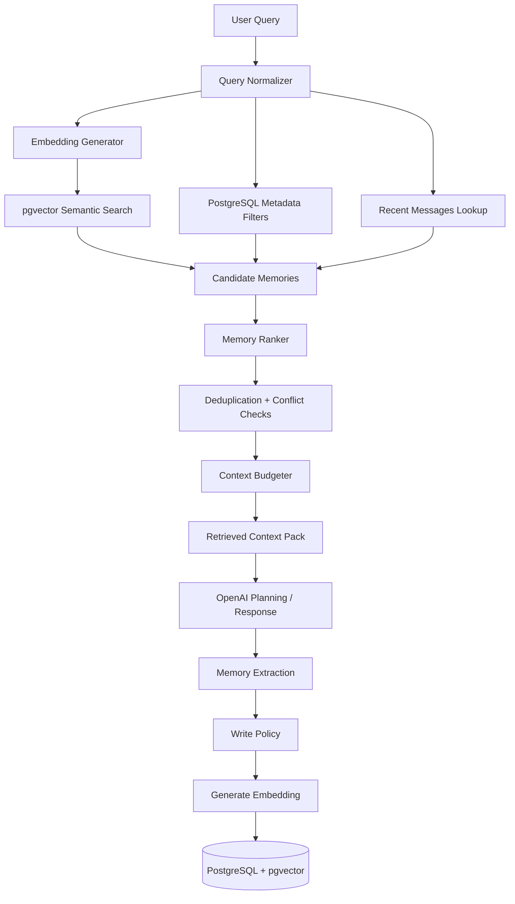
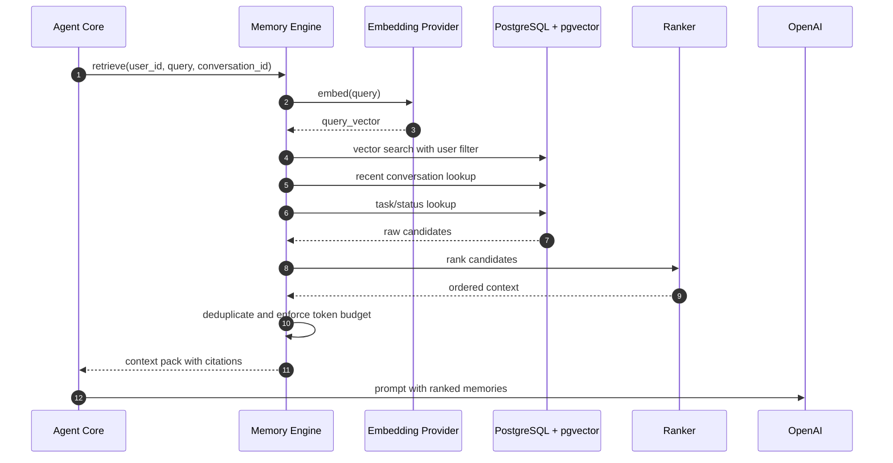
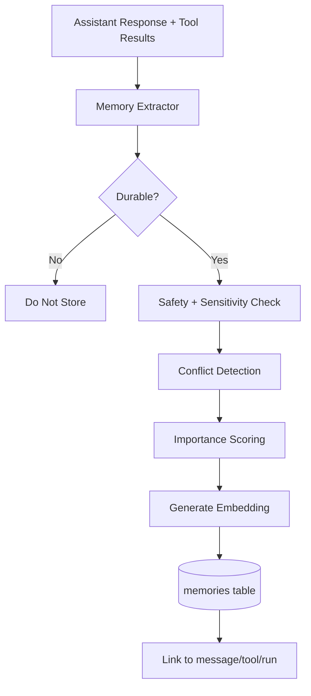

# Memory Architecture

## Purpose

The memory system turns prior interactions, user preferences, tasks, and knowledge into high-signal context for the agent. It must improve answers without leaking irrelevant data, exhausting model context, or creating false confidence.

Phase 1 uses PostgreSQL as the durable memory store and pgvector for semantic search. Embeddings are generated by Sentence Transformers for local/private workloads or OpenAI embeddings when quality, language coverage, or operational consistency is more important than local execution.

## Memory Types

| Type | Lifetime | Storage | Examples | Retrieval Trigger |
| --- | --- | --- | --- | --- |
| Short-term memory | One agent run | In-process run state | Current plan, tool outputs, temporary reasoning state | Always available inside run |
| Conversation memory | Long-lived | `conversations`, `messages` | Prior chat turns, final answers, corrections | Same conversation or user asks about prior discussion |
| Task memory | Until completed or archived | `tasks`, task-linked `memories` | Reminders, commitments, project state | Requests involving follow-up, planning, status |
| Knowledge memory | Long-lived | `memories` with embeddings | Preferences, facts, summaries, external docs | Semantic similarity or explicit lookup |
| Episodic memory | Long-lived but compacted | `memories` | "Last week we decided..." | Temporal or event-based queries |

## Memory Data Model

Each memory record should include:

| Field | Purpose |
| --- | --- |
| `id` | Stable memory identifier. |
| `user_id` | Hard authorization boundary. |
| `conversation_id` | Optional link to source conversation. |
| `task_id` | Optional link to task or workflow. |
| `type` | `preference`, `fact`, `summary`, `task`, `tool_result`, `document`, `episodic`. |
| `content` | Human-readable memory content. |
| `embedding` | Vector representation for semantic search. |
| `importance` | Manual or model-derived priority from 0.0 to 1.0. |
| `confidence` | Confidence in correctness from 0.0 to 1.0. |
| `source` | User, assistant, tool, integration, import, summarizer. |
| `metadata` | JSONB provider ids, labels, timestamps, and filters. |
| `last_accessed_at` | Supports reinforcement and decay. |
| `expires_at` | Optional TTL for time-sensitive facts. |

## Memory Architecture



## Retrieval Flow



## Semantic Search

Semantic search should run with hard metadata filters first, then vector similarity.

Recommended query shape:

```sql
SELECT id, content, type, importance, confidence, metadata,
       1 - (embedding <=> :query_embedding) AS similarity
FROM memories
WHERE user_id = :user_id
  AND deleted_at IS NULL
  AND (expires_at IS NULL OR expires_at > now())
  AND (:memory_type IS NULL OR type = :memory_type)
ORDER BY embedding <=> :query_embedding
LIMIT :candidate_limit;
```

For Phase 1, use cosine distance with normalized embeddings. If the embedding provider changes, store `embedding_model` and `embedding_dimensions` to support backfills and mixed-model migration.

## Memory Ranking Strategy

Ranking must blend semantic relevance with operational usefulness. A memory that is highly similar but stale, low-confidence, or contradicted should not dominate the context pack.

### Score Formula

```text
score =
  (0.45 * semantic_similarity) +
  (0.20 * importance) +
  (0.15 * recency_score) +
  (0.10 * confidence) +
  (0.05 * source_quality) +
  (0.05 * task_relevance) -
  conflict_penalty -
  staleness_penalty
```

| Factor | Description |
| --- | --- |
| `semantic_similarity` | pgvector cosine similarity between query and memory. |
| `importance` | User-pinned or model-derived durable importance. |
| `recency_score` | Time decay based on `created_at` and `last_accessed_at`. |
| `confidence` | Whether the memory is known, inferred, imported, or uncertain. |
| `source_quality` | User-stated preferences rank higher than model summaries. |
| `task_relevance` | Boost when memory is linked to active tasks. |
| `conflict_penalty` | Applied when newer memories contradict older memories. |
| `staleness_penalty` | Applied to time-sensitive memories past their usefulness. |

### Ranking Rules

| Rule | Rationale |
| --- | --- |
| User-authored preferences outrank inferred preferences. | Explicit user intent is authoritative. |
| Newer corrections suppress older facts. | Prevents repeated mistakes after user correction. |
| Active task memories outrank archived task memories. | Current commitments matter more than old plans. |
| Tool results are context, not truth forever. | External data may become stale. |
| Low-confidence memories require cautious language. | Avoids turning guesses into facts. |

## Context Pack Format

The memory engine returns a structured context pack rather than raw text concatenation.

```json
{
  "query": "What should I prepare for today's meetings?",
  "memories": [
    {
      "id": "mem_123",
      "type": "preference",
      "content": "User prefers concise meeting briefs with risks first.",
      "score": 0.91,
      "source": "user",
      "created_at": "2026-06-20T08:30:00Z"
    }
  ],
  "recent_messages": [],
  "active_tasks": [],
  "omitted": {
    "count": 7,
    "reason": "token_budget"
  }
}
```

## Memory Write Policy

Not every message becomes memory. The agent should store durable memory only when it is likely to help future work.

| Candidate | Store? | Notes |
| --- | --- | --- |
| Explicit preference | Yes | High importance and confidence. |
| User correction | Yes | Also mark superseded memory if applicable. |
| Temporary request detail | No by default | Keep in conversation messages only. |
| Task commitment | Yes | Link to `tasks`. |
| Tool result summary | Sometimes | Store only if reusable and not sensitive. |
| Sensitive personal data | Only with policy approval | Minimize and encrypt where required. |

## Memory Storage Flow



## Conversation Memory

Conversation memory is the canonical transcript. It is optimized for replay and debugging, not semantic retrieval. The agent should summarize long conversations into knowledge memories when:

- The conversation exceeds a configured token threshold.
- The user establishes a reusable preference.
- The conversation produces a plan, decision, or task.
- The agent needs to preserve context across sessions.

## Task Memory

Task memory captures work state:

| State | Meaning |
| --- | --- |
| `pending` | Known task, not started. |
| `in_progress` | Agent or user is actively working on it. |
| `blocked` | Requires user input or external availability. |
| `completed` | Done and safe to summarize. |
| `cancelled` | No longer relevant. |

Task memory should support reminders, daily briefings, dependency tracking, and recovery after failed tool execution.

## Knowledge Memory

Knowledge memories are compact, reusable statements:

- Preferences: "User prefers..."
- Stable facts: "User's primary GitHub organization is..."
- Project context: "Personal-AI-Agent uses FastAPI, Celery, PostgreSQL, and Redis."
- Summaries: "The Q3 planning discussion concluded..."

Knowledge memories should be short enough to embed well and specific enough to be useful.

## Embedding Generation

| Provider | Strength | Tradeoff |
| --- | --- | --- |
| Sentence Transformers | Local execution, privacy, lower marginal cost | Requires model hosting and tuning. |
| OpenAI embeddings | Strong quality, managed scaling, consistent API | External dependency and token cost. |

Implementation requirements:

- Store the embedding model name on each memory.
- Reject writes when vector dimensions do not match the active index.
- Backfill embeddings asynchronously after model migration.
- Use idempotency keys for embedding jobs.
- Do not embed secrets that should not leave the process if using external embeddings.

## Compaction and Decay

Memory quality degrades if the system stores everything forever. Phase 1 should include simple maintenance jobs:

| Job | Frequency | Action |
| --- | --- | --- |
| Conversation summarization | After long conversations | Create compact summary memories. |
| Stale memory decay | Daily | Lower rank for expired or old operational facts. |
| Duplicate merge | Daily or weekly | Merge semantically similar memories. |
| Conflict review | On write | Mark superseded memory ids. |
| Access reinforcement | On retrieval | Update `last_accessed_at` and `access_count`. |

## Failure Handling

| Failure | Behavior |
| --- | --- |
| Embedding generation fails | Continue without semantic memory if the request can still be answered; enqueue retry. |
| Vector index unavailable | Fall back to recent messages and metadata search. |
| Memory write fails | Complete user response if safe, mark run with warning, retry background storage. |
| Conflicting memories found | Prefer newer user-authored memory and surface uncertainty when relevant. |
| Context too large | Apply ranking budget and summarize lower-ranked clusters. |

## Future Scalability Notes

- Add read replicas for memory-heavy workloads.
- Partition `memories` by `user_id` hash or creation month if table size grows substantially.
- Add hybrid search with full-text `tsvector` plus pgvector.
- Introduce hierarchical memory: raw messages, summaries, durable facts, and user profile.
- Consider external vector databases only when pgvector cannot satisfy latency, scale, or isolation requirements.

