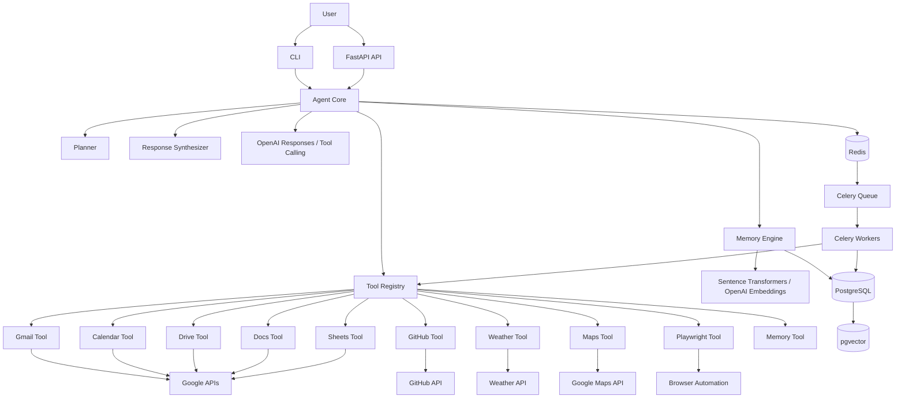
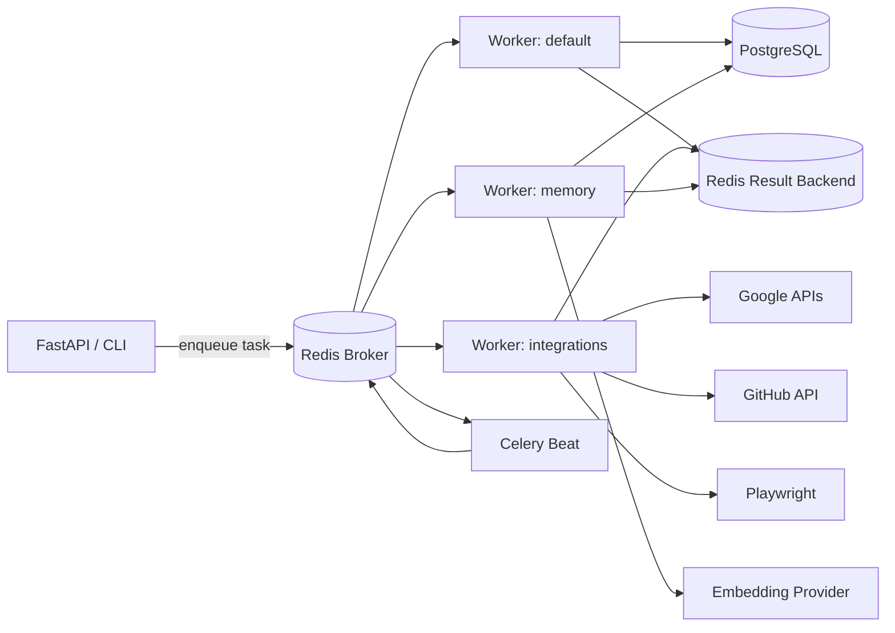
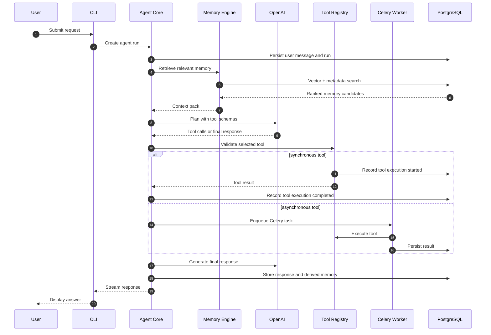

# Personal-AI-Agent System Design

## Executive Summary

Personal-AI-Agent is a personal productivity agent that accepts requests through a CLI, plans work with OpenAI, retrieves relevant memory from PostgreSQL and pgvector, executes tools against user-approved integrations, and records the full lifecycle for audit, replay, and improvement.

Phase 1 optimizes for correctness, auditability, and a small operational footprint. The architecture deliberately keeps the control plane in Python/FastAPI, the durable state in PostgreSQL, semantic retrieval in pgvector, transient coordination in Redis, and long-running integration work in Celery workers.

## Architectural Principles

| Principle | Design Implication |
| --- | --- |
| Explicit boundaries | Agent planning, tool execution, memory, persistence, and integrations are independently testable modules. |
| Durable by default | Conversations, messages, memories, tool executions, and agent runs are stored in PostgreSQL before they are used for product decisions. |
| Async for slow work | API and CLI paths do not block on long Google, GitHub, Playwright, or enrichment jobs unless the user explicitly requests synchronous execution. |
| Tool calls are auditable | Every tool call has inputs, normalized outputs, status, latency, and error metadata. |
| Memory is ranked, not blindly injected | Retrieved memory is scored, filtered, deduplicated, and budgeted before it is sent to OpenAI. |
| Vendor APIs are behind adapters | Google APIs, GitHub, Weather, Maps, OpenAI, and embedding providers are isolated behind tool/integration interfaces. |

## High-Level Architecture

## Service Boundaries

| Boundary | Ownership | Responsibilities | Does Not Own |
| --- | --- | --- | --- |
| CLI (`apps/cli`) | User entry point | Local command parsing, auth bootstrap, request submission, streaming output | Planning, persistence, direct third-party API logic |
| FastAPI (`apps/api`) | HTTP control plane | Request validation, authentication, agent run orchestration, health checks, webhooks | Provider-specific business logic |
| Agent Core (`agent/*`) | Reasoning runtime | Planning, memory retrieval, tool selection, response synthesis, run state transitions | OAuth token storage internals, database connection pooling |
| Tool Registry (`agent/tools`) | Capability catalog | Tool metadata, schemas, permission checks, dispatch, result normalization | External API client implementation details |
| Memory Engine (`agent/memory`) | Context layer | Embedding generation, memory ranking, retrieval, compaction, storage policies | User-facing response generation |
| Database (`database/*`) | Durable state | SQLAlchemy models, repositories, migrations, transactions | Agent reasoning |
| Workers (`apps/worker`, `workers`) | Async execution | Celery task handlers, retries, scheduled jobs, background sync | API request validation |
| Integrations (`integrations/*`) | Provider adapters | Google, GitHub, Weather, Maps, Playwright clients | Cross-provider planning |

## Agent Components

| Component | Purpose | Phase 1 Contract |
| --- | --- | --- |
| Planner | Converts the user request and retrieved context into an execution plan. | Produces a bounded list of steps with required tools, expected outputs, and user-visible intent. |
| Tool Selector | Chooses allowed tools from registry metadata. | Uses OpenAI tool calling with JSON schemas owned by each tool. |
| Tool Executor | Runs tools synchronously or submits async jobs. | Validates inputs, enforces permissions, records `tool_executions`. |
| Memory Retriever | Fetches contextual memory before planning and before final synthesis when needed. | Combines semantic search, recency, importance, and conversation scope. |
| Response Synthesizer | Produces the final answer from messages, plan state, tool outputs, and memory. | Must cite tool results internally by execution id for auditability. |
| Run Recorder | Persists `agent_runs`, messages, tool calls, token usage, timings, and failure metadata. | All state changes happen through repository methods inside transactions. |

## Memory Components

| Component | Storage | Role |
| --- | --- | --- |
| Short-term memory | In-process run state and current conversation messages | Keeps immediate context small and precise. |
| Conversation memory | `conversations`, `messages` | Preserves interaction history and supports replay/debugging. |
| Task memory | `tasks`, task-linked `memories` | Tracks user commitments, status, deadlines, and execution state. |
| Knowledge memory | `memories` with embeddings | Stores durable facts, preferences, summaries, and external knowledge snippets. |
| Vector index | `memories.embedding vector(n)` using pgvector | Enables semantic retrieval by meaning rather than keywords. |

## External Integrations

| Integration | Primary Use | API Boundary | Risk Controls |
| --- | --- | --- | --- |
| Gmail | Search, summarize, draft, classify email | Google Gmail API | OAuth scopes, read/write tool split, confirmation for sends |
| Calendar | Availability, event lookup, scheduling | Google Calendar API | Timezone normalization, conflict checks, confirmation before create/update/delete |
| Drive | File search, metadata, retrieval | Google Drive API | MIME filtering, least-privilege scopes |
| Docs | Read/update docs | Google Docs API | Revision tracking, patch preview before destructive edits |
| Sheets | Read/write structured spreadsheet data | Google Sheets API | Range validation, dry-run summaries |
| GitHub | Issues, PRs, repo metadata | GitHub REST/GraphQL APIs | Repo allowlists, token scope validation |
| Weather | Forecasts and current conditions | Weather API | Cache by location/time window |
| Maps | Geocoding, places, routes | Google Maps API | Quota protection, location privacy controls |
| Playwright | Browser automation for approved workflows | Local browser runtime | Sandbox profiles, screenshots/logging, domain allowlists |

## Worker Architecture

Celery workers execute work that is slow, retryable, scheduled, or not required for the immediate user response.

### Worker Queues

| Queue | Workload | Retry Policy |
| --- | --- | --- |
| `default` | General background tasks, lightweight follow-ups | 3 retries with exponential backoff |
| `integrations` | Google/GitHub/Maps/Weather API calls | Retry on 429/5xx, no retry on auth or validation failures |
| `memory` | Embedding generation, summarization, memory compaction | Retry transient provider failures, dead-letter malformed payloads |
| `browser` | Playwright automation | Low concurrency, screenshot artifacts, strict timeouts |
| `scheduled` | Daily briefings, sync jobs, reminders | Idempotency key required |

## Redis Usage

| Usage | Key Pattern | TTL | Notes |
| --- | --- | --- | --- |
| Celery broker | Celery-managed | Until acknowledged | Durable enough for Phase 1, can move to RabbitMQ/SQS later. |
| Celery result backend | Celery-managed | 1-7 days | Store only result references for large payloads. |
| Run locks | `lock:agent_run:{run_id}` | 5-30 minutes | Prevent duplicate execution. |
| Rate limit buckets | `rl:{provider}:{user_id}` | Provider window | Protect external API quotas. |
| OAuth state | `oauth:state:{nonce}` | 10 minutes | CSRF protection during account linking. |
| Hot retrieval cache | `memory:retrieval:{hash}` | 1-15 minutes | Avoid duplicate vector searches during multi-step runs. |

Redis is not the source of truth. Any state required for correctness must be persisted in PostgreSQL.

## Celery Usage

Celery is used for:

- Daily briefing generation and delivery.
- Memory embedding and compaction.
- Long-running tool execution.
- External service synchronization.
- Retryable provider calls.
- Webhook fan-out.

Every Celery task should include:

| Field | Purpose |
| --- | --- |
| `task_id` | Celery id for operational tracing. |
| `agent_run_id` | Links async work to an agent run when applicable. |
| `user_id` | Enables authorization and rate limiting. |
| `idempotency_key` | Prevents duplicate side effects on retry. |
| `attempt` | Supports retry observability and dead-letter routing. |

## PostgreSQL Usage

PostgreSQL stores:

- Users and integration identity metadata.
- Conversations and messages.
- Agent run state.
- Tool execution audit logs.
- Tasks and daily briefings.
- Memories and vector embeddings via pgvector.

PostgreSQL should be accessed through repositories, not directly from agent planning code. Phase 1 uses one primary database. Future phases can add read replicas, table partitioning, or external vector infrastructure without changing agent-level contracts.

## Request Lifecycle

## Deployment Topology

| Process | Scaling Unit | Suggested Phase 1 Runtime |
| --- | --- | --- |
| FastAPI API | Horizontally scalable stateless service | 1-2 containers |
| CLI | User machine or local process | Python console app |
| Celery worker | Queue-specific process | 1 worker per queue class |
| Celery beat | Singleton scheduler | 1 process with leader election later |
| PostgreSQL | Stateful database | Managed Postgres or Docker for local dev |
| Redis | Stateful cache/broker | Managed Redis or Docker for local dev |

## Failure Domains

| Failure | Expected Behavior |
| --- | --- |
| OpenAI timeout | Retry with backoff for idempotent planning calls, fail run as recoverable if exhausted. |
| Embedding provider unavailable | Continue with conversation-only context when safe, enqueue memory embedding retry. |
| Google/GitHub auth revoked | Mark tool execution failed with `auth_required`, prompt user to reconnect. |
| Redis unavailable | API can accept read-only operations; new async work fails fast with clear degraded-mode status. |
| PostgreSQL unavailable | System is unavailable for write paths; do not attempt memory/tool execution without audit persistence. |
| Celery worker unavailable | Queue work remains pending; API reports accepted but not completed for async operations. |

## Security and Privacy Model

- OAuth tokens are encrypted at rest and never exposed to planner prompts.
- Tool schemas expose capabilities, not secrets.
- Tool arguments are validated before execution and logged with secret redaction.
- Destructive tools require explicit confirmation policies.
- Memory storage is user-scoped by default.
- Cross-user memory retrieval is prohibited in Phase 1.
- Browser automation should run with isolated profiles and domain allowlists.

## Future Scalability Notes

| Pressure | Phase 1 Design | Future Path |
| --- | --- | --- |
| Vector search latency | pgvector HNSW/IVFFlat indexes | Dedicated vector service or Postgres read replica. |
| High async volume | Redis broker with Celery | RabbitMQ, SQS, or Kafka depending on delivery needs. |
| Many integrations | Tool registry modules | Capability service with remote tool execution. |
| Larger memory corpus | Metadata filters and compaction | Hierarchical memory, sharded embeddings, archival tiers. |
| Multi-device usage | FastAPI control plane | Web UI, mobile clients, streaming gateway. |
| Enterprise audit | `agent_runs` and `tool_executions` | Immutable audit log, SIEM export, policy engine. |

