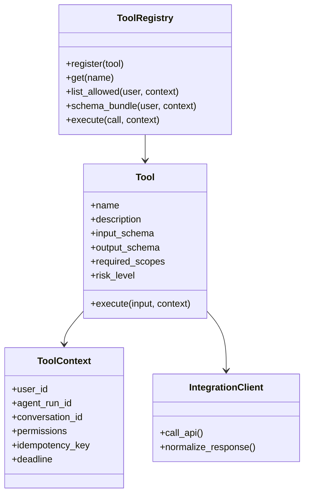
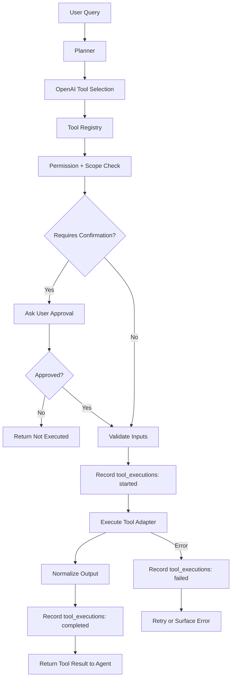
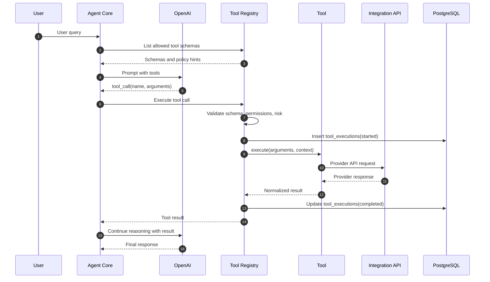

# Tool Architecture

## Purpose

Tools are the agent's controlled interface to the outside world. A tool may read Gmail, create a calendar event, search Drive, query GitHub, fetch weather, look up maps data, retrieve memory, or automate a browser. The tool architecture must be predictable, secure, testable, and auditable.

Phase 1 uses a Tool Registry pattern. The agent exposes tool schemas to OpenAI tool calling, validates selected calls locally, executes through provider adapters, and records all attempts in `tool_executions`.

## Tool Registry Pattern



The registry is responsible for discovery and dispatch. Individual tools are responsible for provider-specific behavior and result normalization.

## Tool Interface

Every tool should implement the following contract:

| Field / Method | Requirement |
| --- | --- |
| `name` | Stable snake-case identifier, for example `gmail.search_messages`. |
| `description` | Short model-facing description of when to use the tool. |
| `input_schema` | JSON Schema used for OpenAI tool calling and local validation. |
| `output_schema` | JSON-compatible normalized response. |
| `required_scopes` | OAuth/API permissions required before execution. |
| `risk_level` | `read`, `write`, `destructive`, or `external_side_effect`. |
| `timeout_seconds` | Upper bound for execution. |
| `execute(input, context)` | Deterministic execution entry point. |

## Available Tools

| Tool Domain | Example Tool Names | Risk Level | Notes |
| --- | --- | --- | --- |
| Gmail | `gmail.search_messages`, `gmail.get_message`, `gmail.create_draft`, `gmail.send_draft` | Read to external side effect | Sending email requires confirmation. |
| Calendar | `calendar.list_events`, `calendar.find_availability`, `calendar.create_event`, `calendar.update_event` | Read/write | All times normalized with user timezone. |
| Drive | `drive.search_files`, `drive.get_file_metadata`, `drive.download_text` | Read | Binary files require explicit parser support. |
| Docs | `docs.get_document`, `docs.apply_patch` | Read/write | Writes should show patch summary. |
| Sheets | `sheets.read_range`, `sheets.update_range`, `sheets.append_rows` | Read/write | Validate spreadsheet id, sheet name, and range. |
| GitHub | `github.search_issues`, `github.get_pr`, `github.create_issue_comment` | Read/write | Repo allowlist recommended. |
| Weather | `weather.get_forecast`, `weather.get_current` | Read | Cache by location and time window. |
| Maps | `maps.geocode`, `maps.place_search`, `maps.route` | Read | Avoid storing precise location unnecessarily. |
| Memory | `memory.search`, `memory.store`, `memory.update` | Read/write | User-scoped only in Phase 1. |
| Playwright | `browser.open_page`, `browser.extract_text`, `browser.screenshot` | Read/write depending action | Use domain allowlists and timeouts. |

## Tool Execution Flow



## Sequence: Planner to Tool Execution



## Sync vs Async Tools

| Execution Mode | Use When | Examples |
| --- | --- | --- |
| Synchronous | Expected latency under a few seconds and required for final response | Memory search, weather lookup, calendar list |
| Asynchronous | Long-running, rate-limited, browser-based, or not needed immediately | Drive sync, embedding backfill, Playwright extraction, daily briefing |
| Hybrid | Start sync, continue async if timeout threshold is reached | Gmail search over large mailbox, GitHub repository scan |

## Tool Result Contract

Tool outputs should be structured and compact:

```json
{
  "status": "success",
  "tool_name": "calendar.list_events",
  "summary": "Found 4 events for 2026-06-25.",
  "data": {
    "events": []
  },
  "metadata": {
    "provider": "google_calendar",
    "latency_ms": 481,
    "next_page_token": null
  }
}
```

The model should receive summarized, relevant outputs. Raw provider payloads can be stored in PostgreSQL JSONB only when needed for replay and after secret redaction.

## Risk and Permission Model

| Risk Level | Examples | Required Control |
| --- | --- | --- |
| `read` | Search Gmail, read calendar, fetch weather | OAuth/API permission check. |
| `write` | Create calendar draft, update sheet | Confirmation may be skipped only for user-approved automation. |
| `destructive` | Delete event, remove file permission | Explicit confirmation required. |
| `external_side_effect` | Send email, post GitHub comment | Explicit confirmation and idempotency key required. |

Tool execution should fail closed. If policy is ambiguous, the tool must not execute.

## Idempotency

Every side-effecting tool call needs an idempotency key:

```text
{user_id}:{agent_run_id}:{tool_name}:{stable_hash(arguments)}
```

Use the idempotency key to:

- Prevent duplicate emails or calendar events during retries.
- Recover safely after worker crashes.
- Link user confirmation to the exact action approved.

## Error Handling

| Error Class | Retry? | User Message |
| --- | --- | --- |
| Validation error | No | Ask for corrected input or explain unsupported request. |
| Missing permission | No | Ask user to connect or expand integration permissions. |
| Auth revoked | No | Ask user to reconnect account. |
| Rate limited | Yes | Explain delay if blocking response. |
| Provider 5xx | Yes | Retry with backoff, then surface provider outage. |
| Timeout | Maybe | Retry if idempotent; otherwise ask user before repeating side effect. |

## Observability

Each tool execution should emit:

| Signal | Fields |
| --- | --- |
| Log | `tool_name`, `agent_run_id`, `user_id`, `status`, `latency_ms`, `error_code`. |
| Metric | Count, latency histogram, failure count, retry count. |
| Trace span | Provider API call, validation, normalization, persistence. |
| Audit row | Full lifecycle in `tool_executions`. |

## Future Scalability Notes

- Move high-risk tools behind a policy engine.
- Split tool execution into a separate service if worker isolation becomes necessary.
- Add remote tool plugins with signed manifests and sandboxed execution.
- Add per-provider circuit breakers and adaptive rate limiting.
- Add tool result caching for deterministic read-only calls.

